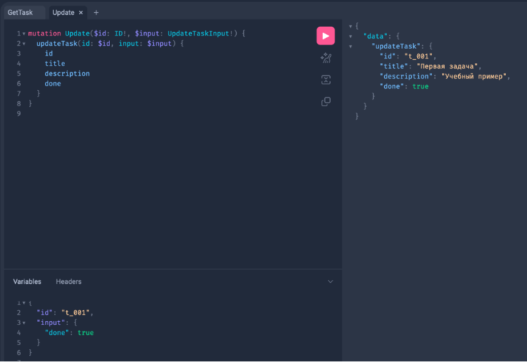
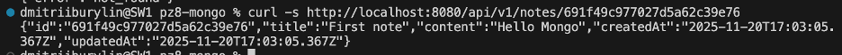
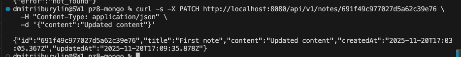
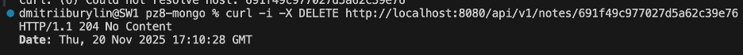

# Практическое занятие №8 Бурылин Дмитрий ПИМО-01-25: Работа с MongoDB

# Описание проекта
Проект демонстрирует работу с MongoDB в Go-приложении, включая CRUD-операции с заметками.

## Требования
* Go версии 1.21 или выше
* Docker
* curl или Postman для тестирования

# Ход выполнения практической работы

## Запуск MongoDB через Docker
```
docker compose up -d
```

```
docker compose ps
```


## Проверка подключения к MongoDB
```
docker exec -it mongo-dev mongosh -u root -p secret --authenticationDatabase admin
```


## Запуск сервера
```
docker compose up -d
```

```
go run ./cmd/api
```


## Примеры запросов и ответы 
```
curl -X POST http://localhost:8080/api/v1/notes \
  -H "Content-Type: application/json" \
  -d '{"title":"Первая заметка","content":"Содержание заметки"}' | jq
```

```
curl -s http://localhost:8080/api/v1/notes?limit=5&skip=0&q=first
```

```
curl -s http://localhost:8080/api/v1/notes/691f49c977027d5a62c39e76
```

```
curl -s -X PATCH http://localhost:8080/api/v1/notes/691f49c977027d5a62c39e76 \
  -H "Content-Type: application/json" \
  -d '{"content":"Updated content"}'
```

```
curl -i -X DELETE http://localhost:8080/api/v1/notes/691f49c977027d5a62c39e76
```


## Типовые ошибки и их отладка:

* connection refused / i/o timeout — проверьте, что контейнер с Mongo запущен и порт 27017 проброшен.
* Аутентификация — используйте ?authSource=admin и правильные root/secret.
* duplicate key error — сработал уникальный индекс title. HTTP 409 возвращаем в create.
* invalid ObjectID — при неверном id возвращайте 404 (мы мапим ошибку на ErrNotFound).
* CORS (если будете дергать из браузера) — добавьте middleware CORS либо тестируйте через curl/Postman.

## Ответы на контрольные вопросы:

### 1.	**Чем документная модель MongoDB принципиально отличается от реляционной? Когда она удобнее?**
#### Отличия

1. **Структура данных**  
   * Реляционная: жёстко заданная схема. Данные хранятся в таблицах со строго определёнными столбцами и типами. Все строки таблицы подчиняются одной схеме.  
   * MongoDB: гибкая схема. Данные хранятся в виде документов (BSON‑аналог JSON). Каждый документ в коллекции может иметь свою структуру, поля могут добавляться/удаляться динамически.

2. **Связывание данных**  
   * Реляционная: связи реализуются через JOIN и внешние ключи. Данные нормализованы — разбиты на связанные таблицы.  
   * MongoDB: данные часто денормализованы. Связанные сущности могут встраиваться в документ как вложенные объекты или массивы. Ссылки используются реже.

3. **Язык запросов**  
   * Реляционная: SQL (SELECT, JOIN, GROUP BY, подзапросы).  
   * MongoDB: JSON‑подобные запросы (`find()`, агрегационный конвейер с операторами `$match`, `$group` и др.).

4. **Масштабируемость**  
   * Реляционная: преимущественно вертикальное масштабирование (усиление сервера). Шардирование требует сложной настройки.  
   * MongoDB: горизонтальное шардирование «из коробки» (sharding). Репликация и распределённая архитектура поддерживаются на уровне платформы.

5. **Транзакции**  
   * Реляционная: полные ACID‑транзакции (атомарность, согласованность, изоляция, долговечность), включая межтабличные операции.  
   * MongoDB: ACID‑транзакции в пределах документа или сегмента. С версии 4.0 поддерживаются мультидокументные транзакции, но с ограничениями по производительности и области применения.

6. **Индексы**  
   * Реляционная: B‑деревья, составные индексы, уникальные индексы.  
   * MongoDB: B‑деревья, геоиндексы, текстовые индексы, TTL‑индексы (автоматическое удаление данных по времени) и др.

#### Когда удобнее MongoDB?

* **Динамическая схема.** Если структура данных часто меняется или заранее не определена (например, сбор разнородных пользовательских данных).  
* **Высокая нагрузка.** Для приложений с большим числом операций чтения/записи, где критично горизонтальное масштабирование.  
* **Иерархические данные.** Когда данные естественно представляются в виде вложенных объектов (профили пользователей с массивами интересов, настройки, логи).  
* **Быстрое прототипирование.** Если нужно быстро запустить MVP без миграции схемы.  
* **JSON‑ориентированные сценарии.** Хранение логов, событий, конфигураций, документов в формате, близком к JSON.  
* **Геоданные.** Встроенные геоиндексы и запросы для работы с координатами.

### 2.	**Что такое ObjectID и зачем нужен _id? Как корректно парсить/валидировать его в Go?**

**ObjectID** в MongoDB — это 12‑байтовый уникальный идентификатор документа (по умолчанию используется для поля `_id`). Он состоит из: 4 байт временной метки (время создания), 5 байт случайного значения (уникальность на уровне машины/процесса) и 3 байт инкрементного счётчика (до 16 777 216 ID в секунду на процесс). Представлен как 24‑символьная шестнадцатеричная строка (например, `62170c5af3d27e919f30b100`).

Поле `_id` служит первичным ключом: гарантирует уникальность документов, автоматически индексируется для быстрого поиска, позволяет сортировать документы по времени создания.

В Go для работы с ObjectID используют пакет `go.mongodb.org/mongo-driver/bson/primitive`:
- Парсинг: `primitive.ObjectIDFromHex(idStr)` преобразует шестнадцатеричную строку в ObjectID и возвращает ошибку при неверном формате.
- Валидация: достаточно вызвать `ObjectIDFromHex` — если ошибка отсутствует, строка корректна (24 шестнадцатеричных символа).

### 3.	**Какие операции CRUD предоставляет драйвер MongoDB и какие операторы обновления вы знаете?**

Драйвер MongoDB реализует стандартные CRUD‑операции: **Create** (`InsertOne`, `InsertMany`), **Read** (`FindOne`, `Find`), **Update** (`UpdateOne`, `UpdateMany`, `FindOneAndUpdate`, `ReplaceOne`) и **Delete** (`DeleteOne`, `DeleteMany`).

Для обновления документов используются операторы:  
- `$set` — установить значение поля;  
- `$unset` — удалить поле;  
- `$inc` — увеличить/уменьшить числовое значение;  
- `$push` — добавить элемент в массив;  
- `$pull` — удалить из массива по условию;  
- `$pop` — удалить первый/последний элемент массива;  
- `$currentDate` — установить текущую дату;  
- `$rename` — переименовать поле;  
- `$mul` — умножить числовое значение;  
- `$min`/`$max` — установить значение, если оно меньше/больше заданного.

### 4.	**Как устроены индексы в MongoDB? Как создать уникальный индекс и чем он грозит при вставке?**

**Индексы в MongoDB** — это структуры данных (на основе бинарного дерева), ускоряющие поиск: вместо сканирования всей коллекции система использует индекс как «каталог» для быстрого нахождения документов. По умолчанию есть индекс на поле `_id`. Индексы бывают однополевыми, составными (по нескольким полям), мультиключевыми (для массивов), геопространственными, текстовыми и хеш‑индексами. Создаются методом `createIndex()`, например: `db.collection.createIndex({ fieldName: 1 })` (1 — порядок по возрастанию, −1 — по убыванию).

Уникальный индекс (`unique: true`) гарантирует отсутствие дубликатов значений в индексируемом поле (или комбинации полей). Создаётся так: `db.collection.createIndex({ fieldName: 1 }, { unique: true })` для одного поля или `db.collection.createIndex({ field1: 1, field2: 1 }, { unique: true })` для составного индекса.

При вставке документов уникальный индекс может привести к ошибкам:
- если значение уже есть в коллекции, операция `insertOne`/`insertMany` завершится ошибкой `E11000 duplicate key`;
- если поле отсутствует в документе, MongoDB считает его значение `null`, поэтому в коллекции может быть только один документ без этого поля;
- невозможно создать уникальный индекс, если в коллекции уже есть дубликаты индексируемых полей;
- в шардированных кластерах уникальный индекс должен включать ключ шарда в качестве префикса.

### 5.	**Почему важно использовать context.WithTimeout при вызовах к базе? Что произойдет при его срабатывании?**

Использование `context.WithTimeout` при вызовах к базе данных критически важно для **предотвращения зависаний приложения** и **контроля времени ожидания** операций.

Когда вы оборачиваете вызов к БД в контекст с таймаутом, вы задаёте жёсткий лимит времени на выполнение операции. Если операция не успевает завершиться за отведённый срок, контекст «срабатывает» (отменяется), и драйвер MongoDB:

1. **Прерывает текущую операцию** на стороне клиента (Go‑приложение получает сигнал об отмене).
2. **Отправляет сигнал отмены на сервер** (если возможно) — MongoDB прекращает выполнение запроса.
3. **Возвращает ошибку** в приложение (обычно `context.DeadlineExceeded` или аналогичную).

**Что происходит при срабатывании таймаута:**
- Горутина, выполнявшая запрос, освобождается (не «зависает» в ожидании ответа).
- Соединение с БД не блокируется — остаётся доступным для других запросов.
- Приложение может обработать ошибку (например, вернуть пользователю сообщение «сервис временно недоступен» или повторить операцию).
- Предотвращается накопление «зависших» соединений, которое может привести к исчерпанию пула соединений и отказу сервиса.

**Почему это важно:**
- **Устойчивость.** Приложение не «замирает» из‑за медленного ответа БД.
- **Контроль ресурсов.** Ограничивается время удержания соединений и памяти.
- **Предсказуемость.** Вы точно знаете, сколько максимум времени займёт операция.
- **Защита от каскадных сбоев.** Если БД тормозит, таймаут предотвращает «эффект домино» в микросервисах.


