# Практическое занятие №15 — Деплой приложения на VPS. Настройка systemd. Бурылин Дмитрий ПИМО-01-25

## Цель работы

Освоить публикацию backend-приложения на удалённом Linux-сервере, настроить systemd-сервис с автозапуском, научиться управлять сервисом и анализировать логи.

## Выполненные шаги

### 1. Подключение к VPS по SSH

```bash
ssh user@158.160.202.182
```
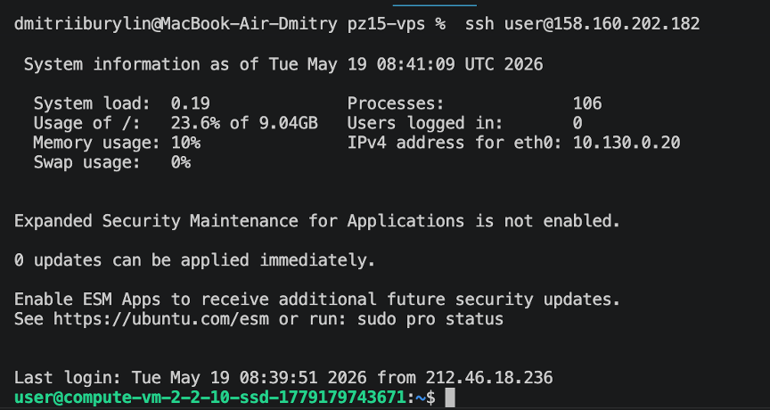

### 2. Обновление пакетов на сервере

```bash
sudo apt update && sudo apt upgrade -y
```
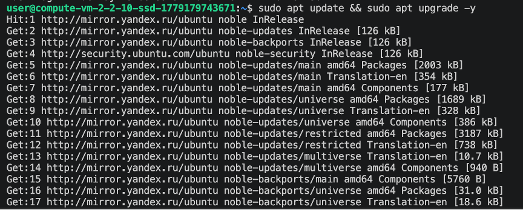

### 3. Создание системного пользователя

```bash
sudo useradd --system --no-create-home --shell /usr/sbin/nologin tasksuser
```
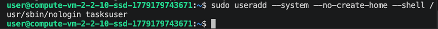

### 4. Создание директории приложения

```bash
sudo mkdir -p /opt/tasks
sudo chown -R tasksuser:tasksuser /opt/tasks
```
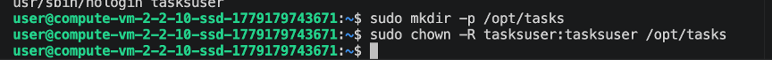

### 5. Создание конфигурационного файла

```bash
sudo mkdir -p /etc/tasks
sudo nano /etc/tasks/tasks.env
```

Содержимое файла:

```
TASKS_PORT=8082
AUTH_BASE_URL=http://127.0.0.1:8081
REDIS_ADDR=127.0.0.1:6379
LOG_LEVEL=info
```
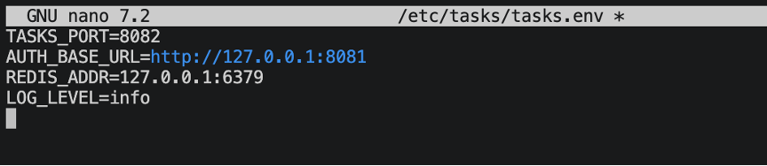

Установка прав доступа:

```bash
sudo chown root:root /etc/tasks/tasks.env
sudo chmod 600 /etc/tasks/tasks.env
```
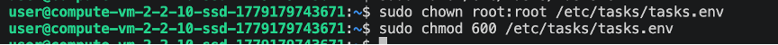

### 6. Сборка Linux-бинарника на локальной машине

```bash
cd tasks
GOOS=linux GOARCH=amd64 go build -o bin/tasks .
```
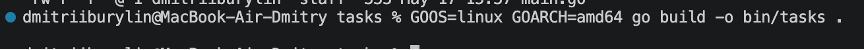

### 7. Копирование бинарника на VPS

```bash
scp -i ~/.ssh/id_ed25519 bin/tasks user@158.160.202.182:/tmp/tasks
```
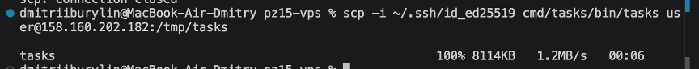

### 8. Перемещение бинарника в рабочую директорию

```bash
sudo mv /tmp/tasks /opt/tasks/tasks
sudo chown tasksuser:tasksuser /opt/tasks/tasks
sudo chmod 755 /opt/tasks/tasks
```
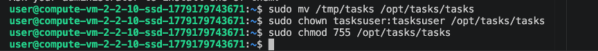

### 9. Создание unit-файла systemd

```bash
sudo nano /etc/systemd/system/tasks.service
```

Содержимое файла:

```ini
[Unit]
Description=Tasks Service
After=network.target

[Service]
Type=simple
User=tasksuser
WorkingDirectory=/opt/tasks
EnvironmentFile=/etc/tasks/tasks.env
ExecStart=/opt/tasks/tasks
Restart=always
RestartSec=2
NoNewPrivileges=true
LimitNOFILE=65535

[Install]
WantedBy=multi-user.target
```
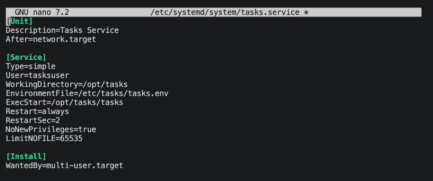

### 10. Перезагрузка конфигурации systemd

```bash
sudo systemctl daemon-reload
```

### 11. Запуск сервиса
```bash
sudo systemctl start tasks
```
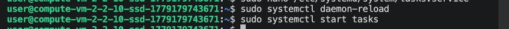

### 12. Включение автозапуска

```bash
sudo systemctl enable tasks
```
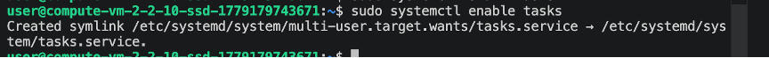

### 13. Проверка статуса сервиса

```bash
sudo systemctl status tasks
```
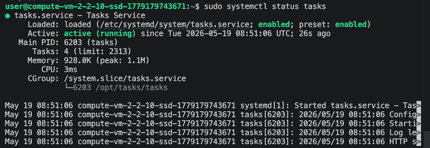

### 14. Просмотр логов

```bash
sudo journalctl -u tasks --no-pager -n 10
sudo journalctl -u tasks -f
```
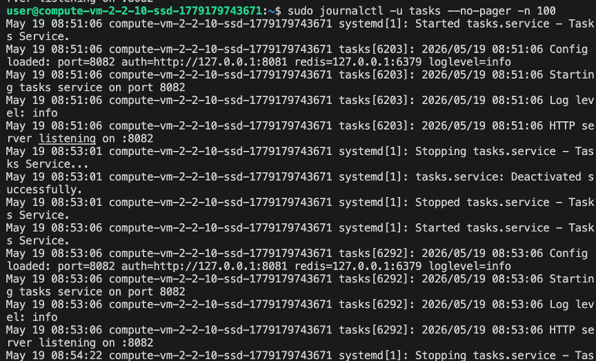

### 15. Проверка доступности приложения

```bash
curl -i http://127.0.0.1:8082/health
```

Ответ:
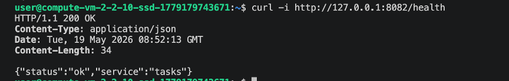


## Управление сервисом

| Действие | Команда |
|---|---|
| Запуск | `sudo systemctl start tasks` |
| Остановка | `sudo systemctl stop tasks` |
| Перезапуск | `sudo systemctl restart tasks` |
| Статус | `sudo systemctl status tasks` |
| Отключить автозапуск | `sudo systemctl disable tasks` |

## Процедура обновления версии

```bash
# 1. Собрать новый бинарник локально
GOOS=linux GOARCH=amd64 go build -o bin/tasks .

# 2. Скопировать на VPS
scp -i ~/.ssh/id_ed25519 bin/tasks user@158.160.202.182:/tmp/tasks

# 3. На сервере — остановить, забэкапить, заменить, запустить
sudo systemctl stop tasks
sudo mv /opt/tasks/tasks /opt/tasks/tasks.old
sudo mv /tmp/tasks /opt/tasks/tasks
sudo chown tasksuser:tasksuser /opt/tasks/tasks
sudo chmod 755 /opt/tasks/tasks
sudo systemctl start tasks
```
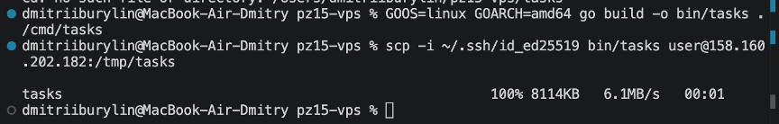
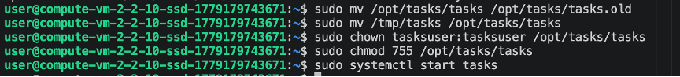

## Процедура отката версии

```bash
sudo systemctl stop tasks
sudo mv /opt/tasks/tasks.old /opt/tasks/tasks
sudo systemctl start tasks

# Проверка после отката
sudo systemctl status tasks
```
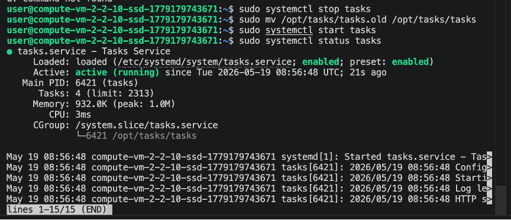

## Ответы на контрольные вопросы

**1. Что такое VPS и зачем он нужен backend-разработчику?**

VPS (Virtual Private Server) — виртуальный сервер с выделенными ресурсами, доступный через интернет. Позволяет backend-разработчику размещать сервисы в сети, обеспечивать их постоянную работу и разделять среду разработки и эксплуатации.

**2. Почему запуск приложения на VPS отличается от локального запуска?**

При локальном запуске приложение работает только на машине разработчика, останавливается при закрытии терминала и не имеет механизмов автоперезапуска. На VPS приложение работает постоянно, управляется системными службами и доступно из сети.

**3. Для чего используется systemd?**

systemd — система инициализации Linux, которая управляет запуском сервисов при старте системы, обеспечивает автоматический перезапуск при сбоях, позволяет просматривать статус и логи, а также управлять жизненным циклом службы.

**4. Почему не рекомендуется запускать серверное приложение от root?**

Запуск от root опасен: ошибка в приложении может затронуть всю систему, а в случае компрометации злоумышленник получает максимальные права. Отдельный пользователь с минимальными привилегиями ограничивает потенциальный ущерб.

**5. Зачем выносить конфигурацию в отдельный env-файл?**

Это позволяет менять параметры без перекомпиляции, не хранить секреты в репозитории, использовать один бинарник в разных средах и упрощает сопровождение приложения.

**6. Что делает параметр Restart=always?**

Указывает systemd всегда перезапускать сервис при его завершении — независимо от причины: аварийное падение, ненулевой код выхода или любое другое завершение процесса.

**7. Для чего нужен EnvironmentFile в unit-файле?**

Подключает внешний файл с переменными окружения, которые будут переданы приложению при запуске. Позволяет хранить конфигурацию отдельно от unit-файла.

**8. Как проверить состояние службы через systemctl?**

```bash
sudo systemctl status tasks
```

**9. Как посмотреть логи сервиса через journalctl?**

```bash
# Последние 100 строк
sudo journalctl -u tasks -n 100

# В реальном времени
sudo journalctl -u tasks -f
```

**10. Что нужно сделать перед обновлением unit-файла systemd?**

После изменения unit-файла необходимо выполнить `sudo systemctl daemon-reload`, чтобы systemd перечитал конфигурацию, а затем перезапустить сервис.

**11. Почему полезно иметь процедуру отката версии?**

Если новая версия приложения содержит ошибку и не запускается, откат позволяет быстро восстановить работоспособность сервиса без простоя, вернув предыдущий рабочий бинарник.

**12. Зачем в реальных системах часто используют NGINX перед приложением?**

NGINX выступает reverse proxy: принимает внешние запросы на портах 80/443, обеспечивает SSL-терминацию, балансировку нагрузки и защиту. Само приложение при этом слушает только локальный адрес и не доступно напрямую из интернета.
```