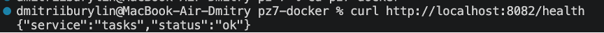

# Практическое занятие №7 — Написание Dockerfile и сборка контейнера. Бурылин Дмитрий. ПИМО-01-25


## Цель практики

Освоить контейнеризацию backend-приложения на Go с помощью Docker:
научиться писать Dockerfile, собирать Docker-образ и запускать
контейнеризированный сервис в воспроизводимой среде.

## Задачи

- [x] Изучить назначение контейнеризации в backend-разработке
- [x] Понять различие между Docker-образом и контейнером
- [x] Освоить структуру и назначение файла Dockerfile
- [x] Научиться использовать multi-stage build для сборки Go-приложения
- [x] Освоить настройку .dockerignore
- [x] Научиться собирать Docker-образ локально
- [x] Научиться запускать контейнер с пробросом портов и передачей переменных окружения
- [x] Освоить базовый запуск нескольких сервисов через Docker Compose
- [x] Научиться проверять работу контейнеризированного приложения

## Структура проекта
```
pz7-docker/
├── deploy/
│ └── docker-compose.yml 
└── services/
└── tasks/
├── cmd/
│ └── tasks/
│ └── main.go 
├── internal/ 
├── .dockerignore 
├── Dockerfile 
├── go.mod 
└── go.sum 
```

## Инициализация Go-модуля

```
cd services/tasks
go mod init example.com/tasks
go mod tidy
```

## Сборка Docker-образа
```
docker build -t techip-tasks:0.1 .
```

```
docker run --rm -p 8082:8082 -e TASKS_PORT=8082 techip-tasks:0.1
```


## Проверка работоспособности
```
curl http://localhost:8082/health
```


## Запуск через Docker Compose
```
cd deploy
docker compose up -d --build
```


## Проверка сервиса:
```
curl http://localhost:8082/health
```


## Ответы на контрольные вопросы

1. Чем Docker-образ отличается от контейнера?

Docker-образ — это статичный шаблон (заготовка), описывающий файловую
систему и параметры запуска. Контейнер — это запущенный экземпляр образа,
живой процесс. Из одного образа можно запустить несколько контейнеров одновременно.

2. Зачем нужен Dockerfile?

Dockerfile — это текстовый файл с набором инструкций для сборки образа.
Он описывает: какую базовую систему использовать, какие файлы скопировать,
какие команды выполнить при сборке и что запускать при старте контейнера.
Dockerfile делает сборку воспроизводимой и автоматизированной.

3. Что такое multi-stage build?

Multi-stage build — это подход, при котором Dockerfile содержит несколько
стадий (FROM ... AS ...). Каждая стадия может использовать свой базовый образ.
В итоговый образ попадают только артефакты из нужных стадий.

4. Почему для Go-сервисов удобно использовать multi-stage build?

Go компилируется в один самодостаточный бинарный файл. Это позволяет:
на первой стадии собрать бинарник в образе с полным Go-тулчейном,
а на второй стадии поместить только этот бинарник в минимальный образ
(например, Alpine). Итоговый образ получается значительно меньше,
не содержит лишних инструментов и ближе к production-стандартам.

5. Зачем нужен .dockerignore?

При сборке Docker передаёт в build context все файлы из текущей директории.
Без .dockerignore туда попадут .git, логи, временные файлы и прочий мусор.
Это замедляет сборку и увеличивает размер образа. .dockerignore позволяет
явно исключить ненужные файлы.

6. Для чего используются переменные окружения в контейнере?

Переменные окружения позволяют передавать конфигурацию в контейнер извне,
не меняя код и не пересобирая образ. Это касается портов, адресов баз данных,
секретов, feature-флагов и т.д. Такой подход соответствует принципу
12-factor app: конфигурация отделена от кода.

7. Что делает флаг -p при запуске контейнера?

Флаг -p хост:контейнер пробрасывает порт с хостовой машины внутрь контейнера.
Например, -p 8082:8082 означает: запросы на порт 8082 хоста будут
перенаправляться на порт 8082 внутри контейнера. Без этого флага сервис
внутри контейнера недоступен снаружи.

8. Для чего нужен Docker Compose?

Docker Compose позволяет описать запуск нескольких контейнеров в одном
YAML-файле и управлять ими как единым приложением. Это удобно для локальной
разработки, когда нужно одновременно запустить несколько сервисов
(backend, база данных, брокер сообщений и т.д.) одной командой.

9. Почему контейнеризация упрощает деплой?

Контейнер содержит всё необходимое для запуска приложения: код, зависимости,
среду выполнения. Это устраняет проблему «у меня работает, а на сервере нет».
Один и тот же образ одинаково запускается локально, в CI/CD, на VPS
и в Kubernetes — без ручной настройки окружения на каждой машине.

10. Почему не стоит вшивать конфигурацию и секреты прямо в образ?

Образ — это артефакт, который может храниться в реестре и быть доступен
многим людям. Если вшить в него секреты (пароли, токены, ключи),
они станут частью образа и могут быть извлечены. Кроме того, при изменении
конфигурации придётся пересобирать образ. Правильный подход — передавать
секреты через переменные окружения или специализированные системы
(Vault, Kubernetes Secrets).