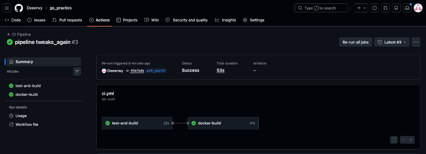

# Практическое занятие №8. Бурылин Дмитрий. ПИМО-01-25
## Настройка GitHub Actions для деплоя Go-приложения


## Тема и цель работы

**Тема:** Настройка GitHub Actions для автоматической сборки, тестирования
и упаковки Go-приложения в Docker-образ.

**Цель:** Освоить основы CI/CD для backend-проекта на Go: настроить
автоматический pipeline для проверки кода, запуска тестов, сборки бинарника
и формирования Docker-образа.

## Что такое CI и CD

### CI — Continuous Integration (Непрерывная интеграция)
CI — это практика автоматической проверки кода после каждого изменения
в репозитории. Система автоматически:
- устанавливает зависимости;
- запускает тесты;
- выполняет сборку приложения;
- подтверждает, что новый код не сломал проект.

CI особенно важен в командной разработке, где изменения поступают регулярно
от нескольких разработчиков.

### CD — Continuous Delivery / Continuous Deployment (Непрерывная доставка / Развёртывание)
CD — это продолжение CI, которое отвечает за доставку результата:
- **Continuous Delivery** — код готов к деплою в любой момент, но релиз
  выполняется вручную;
- **Continuous Deployment** — каждый успешный коммит автоматически
  разворачивается в production.

**Ключевое различие:**
> CI отвечает за проверку и сборку. CD отвечает за упаковку и доставку —
> публикацию Docker-образа и деплой на сервер.


## Платформа

В данной работе использована платформа **GitHub Actions**.

Файл конфигурации pipeline представлен здесь: .github/workflows/ci.yml

## Структура Pipeline

Pipeline состоит из **двух последовательных jobs**:
```
CI Pipeline
│
├── job: test-and-build
│ ├── Checkout репозитория
│ ├── Установка Go 1.23
│ ├── Вывод версии Go
│ ├── Загрузка зависимостей (go mod tidy)
│ ├── Запуск тестов (go test ./...)
│ └── Сборка приложения (go build ./...)
│
└── job: docker-build (запускается после test-and-build)
├── Checkout репозитория
├── Настройка Docker Buildx
└── Сборка Docker-образа (docker build)
```
Пояснение шагов Pipeline

Job: test-and-build

Checkout repository	- Клонирует репозиторий в рабочее окружение runner-а
Setup Go -	Устанавливает Go версии через официальный action
Show Go version - Выводит версию Go в лог — полезно для отладки
Download dependencies - Выполняет go mod tidy для синхронизации зависимостей
Run tests -	Запускает все тесты проекта командой go test ./...
Build application -	Компилирует приложение командой go build ./...

## Формирование тега Docker-образа

В pipeline используется переменная ${{ github.sha }} — полный SHA-хеш
текущего коммита.

## Работа с секретами (CI Secrets)

**Что такое CI Secrets**
CI Secrets — это механизм безопасного хранения чувствительных данных
(токенов, паролей, SSH-ключей) непосредственно в настройках CI-платформы,
а не в коде репозитория.

**Где хранятся секреты**
В GitHub Actions секреты хранятся в разделе:
```
Repository → Settings → Secrets and variables → Actions
```

## Скриншот выполнения Pipeline


## Ответы на контрольные вопросы

1. Чем CI отличается от CD?
CI (Continuous Integration) — автоматическая проверка и сборка кода
при каждом изменении: тесты, компиляция, статический анализ.

CD (Continuous Delivery/Deployment) — автоматическая доставка
проверенного артефакта: публикация Docker-образа в registry, деплой
на сервер.

CI отвечает на вопрос «работает ли код?», CD — «доставлен ли он?»

2. Почему pipeline должен запускать тесты?
Тесты — единственный автоматизированный способ убедиться, что новый код
не сломал существующую логику. Без тестов в pipeline можно задеплоить
нерабочую версию приложения. Pipeline с тестами — это «страховка» всей
команды.

3. Зачем нужен автоматический build?
Автоматический build гарантирует, что код компилируется в чистом
окружении, а не только на машине конкретного разработчика. Это исключает
проблемы типа «у меня работает, а на сервере нет» и обеспечивает
воспроизводимую сборку.

4. Почему важно собирать Docker-образ в CI, а не только локально?
Локальная сборка зависит от среды конкретного разработчика: версии Go,
установленных инструментов, локальных файлов. Сборка в CI:

выполняется в чистом, стандартизированном окружении;
гарантирует воспроизводимость;
исключает «работает только у меня»;
создаёт образ, пригодный для деплоя на любом сервере.
5. Что такое CI secrets?
CI Secrets — это зашифрованные переменные, которые хранятся в настройках
CI-платформы (GitHub Settings) и передаются в pipeline во время выполнения.
Они позволяют использовать токены, пароли и ключи, не раскрывая их
в коде репозитория.

6. Почему нельзя хранить токены и SSH-ключи в репозитории?
Репозиторий может быть публичным или стать публичным случайно. Даже в
приватном репозитории доступ к нему имеет множество людей. Секреты в коде:

остаются в истории Git навсегда (даже после удаления файла);
могут быть скомпрометированы при утечке репозитория;
нарушают принцип разделения кода и конфигурации (12-factor app).
7. Для чего нужен тег Docker-образа?
Тег позволяет:

идентифицировать конкретную версию образа;
откатиться к предыдущей версии при проблемах;
связать образ с конкретным коммитом в репозитории;
управлять версиями в registry (не перезаписывать рабочие образы).
Без тега все образы сливаются в безликий latest, и невозможно понять,
что именно задеплоено на сервере.

8. Что делает job docker-build?
Job docker-build:

Клонирует репозиторий (Checkout).
Инициализирует Docker Buildx — расширенный Docker builder.
Запускает docker build в директории сервиса tasks.
Создаёт Docker-образ с тегом, содержащим SHA текущего коммита.
Job запускается только после успешного test-and-build (needs:),
что гарантирует сборку только проверенного кода.

9. Почему в multi-service проекте важен working-directory?
В репозитории с несколькими сервисами (например, auth и tasks)
у каждого свой go.mod, main.go и Dockerfile. Без явного указания
working-directory команды go test, go build и docker build
будут выполняться в корне репозитория, где нет нужных файлов, что приведёт
к ошибкам. Правильный working-directory направляет каждый шаг в нужную
поддиректорию.

10. Какие риски возникают при полностью автоматическом деплое?

Деплой сломанного кода - Если тесты неполные, баг может автоматически попасть в production
Отсутствие ревью - Код деплоится без ручной проверки человеком
Неоткат при ошибке - Автоматический деплой не всегда включает автоматический rollback
Downtime - Некорректная конфигурация деплоя может уронить сервис
Компрометация секретов - При уязвимости в pipeline злоумышленник может получить доступ к серверу
Потеря данных - Неправильные миграции БД могут выполниться автоматически без проверки