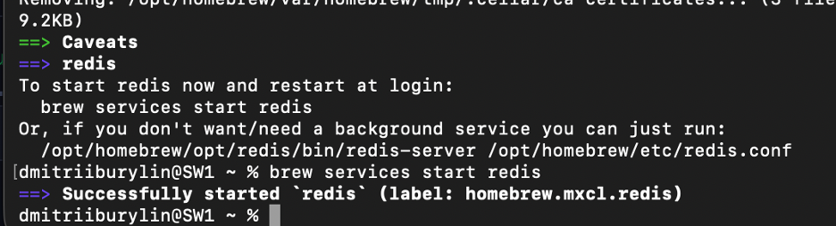
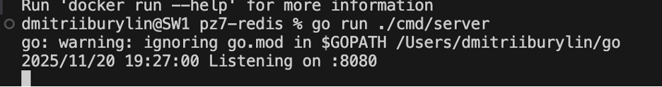
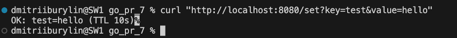
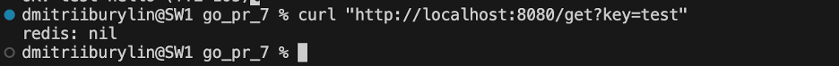
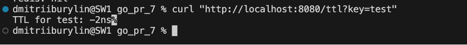

# Практическое занятие 7 Бурылин Дмитрий ПИМО-01-25: Работа с Redis

## Описание проекта

Проект демонстрирует базовую работу с Redis в Go-приложении, включая операции SET, GET и управление TTL.


## Краткое описание

### Redis

**Redis** — это высокопроизводительная in-memory система хранения данных, работающая по принципу ключ-значение. Основные особенности:
* Хранение данных в оперативной памяти
* Поддержка различных структур данных
* Встроенный механизм TTL
* Возможность использования как кэш, брокер сообщений или основное хранилище

### Механизм TTL

**TTL (Time-To-Live)** — механизм автоматического удаления ключей по истечении заданного времени. Используется для:
* Кэширования временных данных
* Автоматического обновления информации
* Предотвращения перегрузки памяти устаревшими данными

## Запуск проекта


# Запуск Redis


# Запуск сервера
go run ./cmd/server


# Тестирование
```
curl "http://localhost:8080/set?key=test&value=hello"
```

```
curl "http://localhost:8080/get?key=test"
```

```
curl "http://localhost:8080/ttl?key=test"
```


## Контрольные вопросы

1. **Чем Redis отличается от реляционной БД?**
   * Redis — NoSQL хранилище
   * Работа с данными в оперативной памяти
   * Отсутствие SQL-запросов
   * Использование команд SET, GET вместо SQL

2. **Какие типы данных поддерживает Redis кроме строк?**
   * Списки
   * Множества
   * Хэши
   * Упорядоченные множества
   * Битовые поля

3. **Зачем нужен TTL? Приведите примеры.**
   * Кэширование временных данных
   * Автоматическое обновление информации
   * Пример: сессии пользователей с ограниченным временем жизни

4. **Как Redis помогает снизить нагрузку на PostgreSQL?**
   * Кэширование часто запрашиваемых данных
   * Уменьшение количества запросов к БД
   * Ускорение ответов API

5. **Что произойдёт, если ключ в Redis «протух» по TTL, а приложение попытается его прочитать?**
   * Ключ автоматически удаляется
   * При попытке чтения возвращается ошибка
   * Приложение должно обработать ошибку и запросить данные из основной БД


