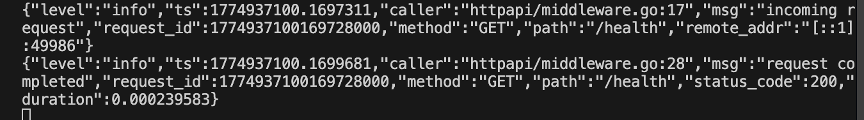
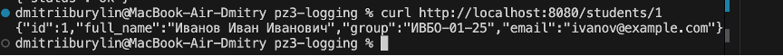

# Практическое занятие №3: Логирование с помощью zap. Ведение структурированных логов. Бурылин Дмитрий ПИМО-01-25

## Идея проекта
В этой работе создаётся учебное HTTP-приложение с двумя маршрутами:
GET /health — проверка работоспособности сервиса;
GET /students/{id} — получение информации о студенте по идентификатору.
Приложение будет использовать zap для записи логов в консоль в структурированном формате.

## Структура проекта
```
pz3-logging/
├── cmd/server/main.go
├── internal/
│   ├── httpapi/
│   │   ├── handler.go
│   │   ├── middleware.go
│   │   └── response_writer.go
│   └── student/
│       ├── model.go
│       └── repo.go
├── pkg/logger/logger.go
├── go.sum
└── go.mod
```
## Команды для выполнения проекта

### Запуск сервера
```
go run ./cmd/server
```
### Запрос /health
```
curl http://localhost:8080/health
```



### Запрос /students/1 (успешный)
```
curl http://localhost:8080/students/1
```



### Запрос /students/abc (ошибка валидации)
```
curl http://localhost:8080/students/abc
```


### Запрос /students/999 (не найден)
```
curl http://localhost:8080/students/999
```


##  Ответы на контрольные вопросы

### 1. Зачем backend-приложению нужно логирование?
Логирование — основной инструмент наблюдаемости. Оно позволяет разработчику узнать, что происходило в приложении: время запуска, пришедшие запросы, вызванные маршруты, результаты обработки, ошибки, длительность операций. Без логов качественное сопровождение серверного приложения практически невозможно.

### 2. Чем обычный текстовый лог отличается от структурированного?
Обычный текстовый лог — это строковое сообщение (например, `user 15 requested /orders at 10:31`). Оно понятно человеку, но плохо поддаётся автоматическому анализу, фильтрации и поиску по полям. Структурированный лог представляет запись в формате ключ-значение (часто JSON): содержит сообщение, уровень важности и набор полей (`method`, `path`, `status_code` и т.д.). Это позволяет легко фильтровать, агрегировать и анализировать логи.

### 3. Что означает structured logging?
Structured logging (структурированное логирование) — это подход, при котором каждая запись лога формируется не как строка, а как набор пар «ключ-значение». Такая запись содержит сообщение, уровень серьёзности и дополнительные атрибуты, что делает логи машинно-читаемыми и удобными для обработки в системах наблюдаемости.

### 4. Какие уровни логирования используются в этой работе?
В работе используются следующие уровни (severity levels):
- **Debug** — подробные технические сведения для отладки.
- **Info** — нормальные рабочие события.
- **Warn** — ситуация отклоняется от ожидаемой, но приложение продолжает работу.
- **Error** — операция завершилась ошибкой.

### 5. Почему полезно логировать HTTP-метод, путь и статус ответа?
Эти поля позволяют точно идентифицировать, какой запрос был обработан, какой ресурс запрашивался и с каким результатом. Без них невозможно понять, например, почему на `/students/abc` вернулась ошибка 400, а на `/students/1` — 200. Статус ответа критичен для оценки корректности работы API.

### 6. Зачем в лог добавляют время выполнения запроса?
Время выполнения (duration) помогает выявлять медленные запросы, узкие места и деградацию производительности. Оно необходимо для мониторинга SLA и диагностики проблем с задержками.

### 7. Почему логирование ошибок должно содержать дополнительный контекст?
Контекст (например, `student_id`, `raw_id`, `error`) позволяет быстро понять причину ошибки, не изучая остальной код. Без контекста сообщение «student not found» бесполезно, если неизвестно, какого именно студента пытались найти.

### 8. В чём практическое преимущество zap?
Zap — это быстрый, структурированный и уровневый логгер. Он предлагает два интерфейса: `Logger` (максимальная производительность) и `SugaredLogger` (удобство). Zap поддерживает JSON-формат «из коробки», настраиваемые выходы (stdout/stderr/файлы), и используется во многих промышленных проектах.

### 9. Что означает maintenance mode у logrus?
Режим maintenance означает, что библиотека больше не получает новых функций, только исправления критических ошибок и обновления зависимостей. Для новых проектов рекомендуется использовать zap или slog.

### 10. Почему structured logging особенно важен для микросервисов и backend API?
В микросервисной архитектуре и API-серверах генерируется огромное количество событий от разных сервисов. Структурированные логи позволяют централизованно собирать, индексировать и искать информацию по любым полям (request_id, user_id, service_name и т.д.). Это ускоряет диагностику инцидентов и анализ поведения системы.

---

## 🛠 Запуск проекта

1. Установите зависимости:
   ```bash
   go mod tidy