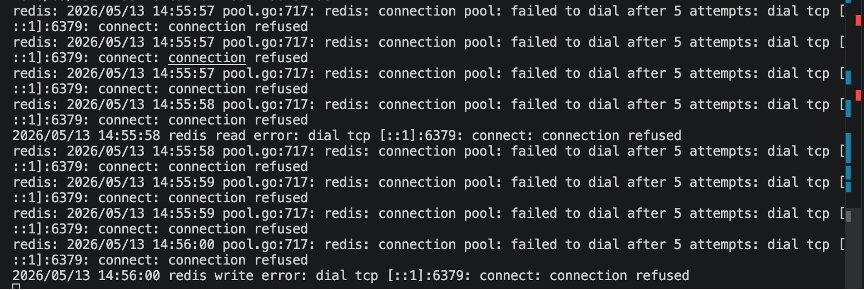

```markdown
# Практическое занятие №9 — Реализация распределённого кэша (Redis). Бурылин Дмитрий ПИМО-01-25

## Дисциплина
Технологии создания программного обеспечения

## Цель
Освоить внедрение распределённого кэша в backend-приложение на Go и реализовать
стратегию cache-aside с использованием Redis, корректного TTL, jitter и устойчивого
поведения сервиса при недоступности кэша.


## Структура проекта

```
pz9-redis-cache/
├── cmd/
│   └── server/
│       └── main.go
├── internal/
│   ├── cache/
│   │   ├── redis.go
│   │   ├── keys.go
│   │   └── ttl.go
│   ├── config/
│   │   └── config.go
│   ├── httpapi/
│   │   └── handler.go
│   ├── service/
│   │   └── task_service.go
│   └── task/
│       ├── model.go
│       └── repo.go
├── deploy/
│   └── redis/
│       └── docker-compose.yml
└── go.mod
```


## Выполненные задания

### Основное задание
Реализован сервис задач с кэшированием на Redis по стратегии cache-aside:
- кэширование чтения задачи по ID (GET /v1/tasks/{id})
- инвалидация кэша при обновлении (PATCH /v1/tasks/{id})
- инвалидация кэша при удалении (DELETE /v1/tasks/{id})
- TTL с jitter для предотвращения одновременного истечения ключей
- деградация без отказа при недоступности Redis

### Дополнительное задание: Отдельное логирование hit/miss (Вариант 2)

В сервисный слой добавлено явное структурированное логирование всех событий кэша:

| Событие             | Формат лога                                           |
|---------------------|-------------------------------------------------------|
| Данные найдены      | `[CACHE HIT] key=tasks:task:1`                        |
| Данных нет в кэше   | `[CACHE MISS] key=tasks:task:1`                       |
| Запись в кэш        | `[CACHE SET] key=tasks:task:1 ttl=134s`               |
| Сброс после PATCH   | `[CACHE INVALIDATED] key=tasks:task:1 (reason: update)` |
| Сброс после DELETE  | `[CACHE INVALIDATED] key=tasks:task:1 (reason: delete)` |
| Ошибка Redis        | `[CACHE ERROR] ...`                                   |


## Запуск проекта

### 1. Запуск Redis

```bash
cd deploy/redis
docker compose up -d
docker compose ps
```


### 2. Инициализация модуля 

```bash
go mod init example.com/pz9-redis-cache
go mod tidy
```

### 3. Запуск сервера

```bash
go run ./cmd/server
```

Сервер запускается на порту `8082`.


## Проверка сценариев

### Чтение задачи (cache miss -> cache set -> cache hit)

```bash
# Первый запрос — cache miss, данные из репозитория, запись в кэш
curl http://localhost:8082/v1/tasks/1

# Второй запрос — cache hit, данные из Redis
curl http://localhost:8082/v1/tasks/1
```


### Валидация при обновлении

```bash
curl -X PATCH http://localhost:8082/v1/tasks/1 \
  -H "Content-Type: application/json" \
  -d '{"id":1,"title":"Обновлённая задача","description":"Новый текст","due_date":"2026-01-22T00:00:00Z"}'

# Следующий GET снова даст cache miss и обновит кэш
curl http://localhost:8082/v1/tasks/1
```


### Валидация при удалении

```bash
curl -X DELETE http://localhost:8082/v1/tasks/1

# Ожидаемый результат — 404 Not Found
curl http://localhost:8082/v1/tasks/1
```


### Деградация при недоступности Redis

```bash
# Остановить Redis
cd deploy/redis
docker compose stop

# Сервис должен продолжить отвечать через репозиторий
curl http://localhost:8082/v1/tasks/2
```

Ожидаемое поведение: сервис не падает, данные возвращаются из репозитория,
в логах появляется предупреждение об ошибке Redis.



## Исходный код

### deploy/redis/docker-compose.yml

```yaml
version: "3.9"

services:
  redis:
    image: redis:7.4
    container_name: redis_cache
    ports:
      - "6379:6379"
```

### internal/config/config.go

```go
package config

import "time"

type Config struct {
    RedisAddr         string
    RedisPassword     string
    CacheTTL          time.Duration
    CacheTTLJitter    time.Duration
    RedisDialTimeout  time.Duration
    RedisReadTimeout  time.Duration
    RedisWriteTimeout time.Duration
}

func New() Config {
    return Config{
        RedisAddr:         "localhost:6379",
        RedisPassword:     "",
        CacheTTL:          120 * time.Second,
        CacheTTLJitter:    30 * time.Second,
        RedisDialTimeout:  2 * time.Second,
        RedisReadTimeout:  2 * time.Second,
        RedisWriteTimeout: 2 * time.Second,
    }
}
```

### internal/task/model.go

```go
package task

import "time"

type Task struct {
    ID          int64     `json:"id"`
    Title       string    `json:"title"`
    Description string    `json:"description"`
    DueDate     time.Time `json:"due_date"`
}
```

### internal/task/repo.go

```go
package task

import (
    "errors"
    "time"
)

var ErrTaskNotFound = errors.New("task not found")

type Repo struct {
    data map[int64]Task
}

func NewRepo() *Repo {
    return &Repo{
        data: map[int64]Task{
            1: {
                ID:          1,
                Title:       "Изучить Redis",
                Description: "Разобрать cache-aside",
                DueDate:     time.Date(2026, 1, 20, 0, 0, 0, 0, time.UTC),
            },
            2: {
                ID:          2,
                Title:       "Сделать ПЗ",
                Description: "Реализовать кэширование по id",
                DueDate:     time.Date(2026, 1, 21, 0, 0, 0, 0, time.UTC),
            },
        },
    }
}

func (r *Repo) GetByID(id int64) (Task, error) {
    t, ok := r.data[id]
    if !ok {
        return Task{}, ErrTaskNotFound
    }
    return t, nil
}

func (r *Repo) Update(task Task) error {
    if _, ok := r.data[task.ID]; !ok {
        return ErrTaskNotFound
    }
    r.data[task.ID] = task
    return nil
}

func (r *Repo) Delete(id int64) error {
    if _, ok := r.data[id]; !ok {
        return ErrTaskNotFound
    }
    delete(r.data, id)
    return nil
}
```

### internal/cache/redis.go

```go
package cache

import (
    "context"
    "time"

    "example.com/pz9-redis-cache/internal/config"
    "github.com/redis/go-redis/v9"
)

func NewRedisClient(cfg config.Config) *redis.Client {
    return redis.NewClient(&redis.Options{
        Addr:         cfg.RedisAddr,
        Password:     cfg.RedisPassword,
        DB:           0,
        DialTimeout:  cfg.RedisDialTimeout,
        ReadTimeout:  cfg.RedisReadTimeout,
        WriteTimeout: cfg.RedisWriteTimeout,
    })
}

func Ping(ctx context.Context, client *redis.Client) error {
    ctx, cancel := context.WithTimeout(ctx, 2*time.Second)
    defer cancel()
    return client.Ping(ctx).Err()
}
```

### internal/cache/keys.go

```go
package cache

import "fmt"

func TaskByIDKey(id int64) string {
    return fmt.Sprintf("tasks:task:%d", id)
}

func TasksListKey() string {
    return "tasks:list"
}
```

### internal/cache/ttl.go

```go
package cache

import (
    "math/rand"
    "time"
)

func TTLWithJitter(base time.Duration, jitter time.Duration) time.Duration {
    if jitter <= 0 {
        return base
    }
    extra := time.Duration(rand.Int63n(int64(jitter) + 1))
    return base + extra
}
```

### internal/service/task_service.go

```go
package service

import (
    "context"
    "encoding/json"
    "errors"
    "log"

    "example.com/pz9-redis-cache/internal/cache"
    "example.com/pz9-redis-cache/internal/config"
    "example.com/pz9-redis-cache/internal/task"
    "github.com/redis/go-redis/v9"
)

type TaskService struct {
    repo  *task.Repo
    redis *redis.Client
    cfg   config.Config
}

func NewTaskService(repo *task.Repo, redisClient *redis.Client, cfg config.Config) *TaskService {
    return &TaskService{
        repo:  repo,
        redis: redisClient,
        cfg:   cfg,
    }
}

func (s *TaskService) GetTaskByID(ctx context.Context, id int64) (task.Task, error) {
    key := cache.TaskByIDKey(id)

    if s.redis != nil {
        cached, err := s.redis.Get(ctx, key).Result()
        if err == nil {
            var t task.Task
            if err := json.Unmarshal([]byte(cached), &t); err == nil {
                log.Printf("[CACHE HIT] key=%s", key)
                return t, nil
            }
            log.Printf("[CACHE ERROR] decode failed for key=%s: %v", key, err)
        } else if !errors.Is(err, redis.Nil) {
            log.Printf("[CACHE ERROR] redis read failed for key=%s: %v", key, err)
        } else {
            log.Printf("[CACHE MISS] key=%s", key)
        }
    }

    t, err := s.repo.GetByID(id)
    if err != nil {
        return task.Task{}, err
    }

    if s.redis != nil {
        bytes, err := json.Marshal(t)
        if err != nil {
            log.Printf("[CACHE ERROR] encode failed for key=%s: %v", key, err)
            return t, nil
        }

        ttl := cache.TTLWithJitter(s.cfg.CacheTTL, s.cfg.CacheTTLJitter)
        if err := s.redis.Set(ctx, key, bytes, ttl).Err(); err != nil {
            log.Printf("[CACHE ERROR] redis write failed for key=%s: %v", key, err)
        } else {
            log.Printf("[CACHE SET] key=%s ttl=%s", key, ttl)
        }
    }

    return t, nil
}

func (s *TaskService) UpdateTask(ctx context.Context, t task.Task) error {
    if err := s.repo.Update(t); err != nil {
        return err
    }

    if s.redis != nil {
        key := cache.TaskByIDKey(t.ID)
        if err := s.redis.Del(ctx, key).Err(); err != nil {
            log.Printf("[CACHE ERROR] redis delete failed for key=%s: %v", key, err)
        } else {
            log.Printf("[CACHE INVALIDATED] key=%s (reason: update)", key)
        }
    }

    return nil
}

func (s *TaskService) DeleteTask(ctx context.Context, id int64) error {
    if err := s.repo.Delete(id); err != nil {
        return err
    }

    if s.redis != nil {
        key := cache.TaskByIDKey(id)
        if err := s.redis.Del(ctx, key).Err(); err != nil {
            log.Printf("[CACHE ERROR] redis delete failed for key=%s: %v", key, err)
        } else {
            log.Printf("[CACHE INVALIDATED] key=%s (reason: delete)", key)
        }
    }

    return nil
}
```

### internal/httpapi/handler.go

```go
package httpapi

import (
    "encoding/json"
    "net/http"
    "strconv"
    "strings"

    "example.com/pz9-redis-cache/internal/service"
    "example.com/pz9-redis-cache/internal/task"
)

type Handler struct {
    service *service.TaskService
}

func NewHandler(service *service.TaskService) *Handler {
    return &Handler{service: service}
}

func (h *Handler) GetTaskByID(w http.ResponseWriter, r *http.Request) {
    if r.Method != http.MethodGet {
        http.Error(w, "method not allowed", http.StatusMethodNotAllowed)
        return
    }

    rawID := strings.TrimPrefix(r.URL.Path, "/v1/tasks/")
    id, err := strconv.ParseInt(rawID, 10, 64)
    if err != nil {
        http.Error(w, "invalid id", http.StatusBadRequest)
        return
    }

    t, err := h.service.GetTaskByID(r.Context(), id)
    if err != nil {
        http.Error(w, "task not found", http.StatusNotFound)
        return
    }

    w.Header().Set("Content-Type", "application/json; charset=utf-8")
    _ = json.NewEncoder(w).Encode(t)
}

func (h *Handler) PatchTask(w http.ResponseWriter, r *http.Request) {
    if r.Method != http.MethodPatch {
        http.Error(w, "method not allowed", http.StatusMethodNotAllowed)
        return
    }

    var t task.Task
    if err := json.NewDecoder(r.Body).Decode(&t); err != nil {
        http.Error(w, "bad json", http.StatusBadRequest)
        return
    }

    if err := h.service.UpdateTask(r.Context(), t); err != nil {
        http.Error(w, "task not found", http.StatusNotFound)
        return
    }

    w.WriteHeader(http.StatusOK)
}

func (h *Handler) DeleteTask(w http.ResponseWriter, r *http.Request) {
    if r.Method != http.MethodDelete {
        http.Error(w, "method not allowed", http.StatusMethodNotAllowed)
        return
    }

    rawID := strings.TrimPrefix(r.URL.Path, "/v1/tasks/")
    id, err := strconv.ParseInt(rawID, 10, 64)
    if err != nil {
        http.Error(w, "invalid id", http.StatusBadRequest)
        return
    }

    if err := h.service.DeleteTask(r.Context(), id); err != nil {
        http.Error(w, "task not found", http.StatusNotFound)
        return
    }

    w.WriteHeader(http.StatusNoContent)
}
```

### cmd/server/main.go

```go
package main

import (
    "context"
    "log"
    "net/http"

    "example.com/pz9-redis-cache/internal/cache"
    "example.com/pz9-redis-cache/internal/config"
    "example.com/pz9-redis-cache/internal/httpapi"
    "example.com/pz9-redis-cache/internal/service"
    "example.com/pz9-redis-cache/internal/task"
)

func main() {
    cfg := config.New()
    repo := task.NewRepo()

    redisClient := cache.NewRedisClient(cfg)
    if err := cache.Ping(context.Background(), redisClient); err != nil {
        log.Println("warning: redis is unavailable at startup:", err)
    }

    taskService := service.NewTaskService(repo, redisClient, cfg)
    handler := httpapi.NewHandler(taskService)

    mux := http.NewServeMux()
    mux.HandleFunc("/v1/tasks/", func(w http.ResponseWriter, r *http.Request) {
        switch r.Method {
        case http.MethodGet:
            handler.GetTaskByID(w, r)
        case http.MethodPatch:
            handler.PatchTask(w, r)
        case http.MethodDelete:
            handler.DeleteTask(w, r)
        default:
            http.Error(w, "method not allowed", http.StatusMethodNotAllowed)
        }
    })

    log.Println("server started on :8082")
    if err := http.ListenAndServe(":8082", mux); err != nil {
        log.Fatal(err)
    }
}
```

---

## Ответы на контрольные вопросы

**1. Что такое cache-aside?**

Cache-aside — это стратегия кэширования, при которой приложение само управляет
наполнением кэша. Алгоритм: сначала проверяется кэш, при наличии данных они
возвращаются клиенту, при отсутствии — приложение обращается к основному хранилищу,
получает данные, кладёт их в кэш и возвращает клиенту.

**2. Почему Redis не должен быть источником истины?**

Redis — это in-memory хранилище с TTL. Данные в нём могут истечь, быть удалены
или потеряны при перезапуске. Кроме того, Redis может быть недоступен. Источником
истины должна оставаться основная база данных, которая гарантирует долговременное
и надёжное хранение данных.

**3. Зачем нужен TTL?**

TTL ограничивает время жизни ключа в кэше. Без него данные могут храниться
бесконечно долго, устаревать и занимать память. TTL обеспечивает автоматическое
самообновление кэша: через заданный промежуток времени следующий запрос снова
пойдёт в основное хранилище и запишет актуальные данные.

**4. Что такое jitter?**

Jitter — это случайный разброс, добавляемый к базовому TTL. Например, если
базовый TTL равен 120 секундам, а jitter — до 30 секунд, итоговый TTL будет
от 120 до 150 секунд. Это делает моменты истечения ключей более равномерными.

**5. Почему одинаковый TTL для всех ключей может быть проблемой?**

Если все ключи имеют одинаковый TTL, они могут истечь почти одновременно.
В этот момент большое количество запросов одновременно пойдёт в основную базу
данных, что создаст резкий всплеск нагрузки. Это явление называется cache
stampede или thundering herd.

**6. Как должен вести себя сервис при недоступности Redis?**

Сервис должен продолжать обслуживать запросы через основное хранилище. Ошибка
подключения к Redis должна логироваться, но не приводить к возврату ошибки
клиенту. Таймауты на операции с Redis предотвращают зависание сервиса при
недоступности кэша.

**7. Почему кэш нужно инвалидировать после изменения данных?**

После изменения данных в основном хранилище кэш содержит устаревшее значение.
Если не удалить ключ, клиент будет получать старые данные вплоть до истечения
TTL. Явная инвалидация гарантирует, что следующий запрос получит актуальные
данные из основного хранилища.

**8. Чем кэширование одной сущности проще, чем кэширование списка?**

При кэшировании одной сущности ключ однозначно идентифицируется по ID, а
инвалидация затрагивает только один конкретный ключ. Список сложнее: он может
зависеть от параметров пагинации и фильтрации, а любое изменение любой из
входящих в него сущностей делает весь список устаревшим.

**9. В чём смысл ключа вида tasks:task:<id>?**

Такой формат ключа является понятным, предсказуемым и единообразным. Пространство
имён tasks позволяет группировать ключи по домену, подтип task уточняет сущность,
а суффикс <id> однозначно идентифицирует конкретную запись. Это упрощает
отладку, мониторинг и выборочную инвалидацию.

**10. Почему Redis рассматривается как внешняя инфраструктурная зависимость?**

Redis запускается как отдельный процесс или кластер, доступный по сети. В отличие
от переменной в памяти приложения, он существует независимо от жизненного цикла
сервиса: может быть перезапущен, стать недоступным или обслуживать несколько
экземпляров приложения одновременно. Именно поэтому к нему применяются те же
принципы устойчивости, что и к базе данных: таймауты, обработка ошибок и
деградация без отказа основного функционала.
```